# DESCARGA DE DATOS CON REUTERS EIKON <!-- omit from toc -->

# <a name="_hlk487785372"></a>Tabla de Contenido <!-- omit from toc -->
1. [Instalar en una nueva Maquina](#instalar-en-una-nueva-maquina)
   1. [Clonar el repositorio al disco](#clonar-el-repositorio-al-disco)
   2. [Crear Entorno Virtual e Instalar paquetes](#crear-entorno-virtual-e-instalar-paquetes)
   3. [Configuración de Eikon](#configuración-de-eikon)
      1. [Crear un App Key](#crear-un-app-key)
   4. [Configuración de .env](#configuración-de-env)
2. [Uso de Eikon](#uso-de-eikon)
3. [Hacer llamadas con Python](#hacer-llamadas-con-python)
4. [Uso de los Notebooks de Descarga](#uso-de-los-notebooks-de-descarga)
   1. [mass\_download.ipynb](#mass_downloadipynb)
   2. [download\_calcs\_ranking.ipynb](#download_calcs_rankingipynb)
   3. [index\_constituents\_mask.ipynb](#index_constituents_maskipynb)
5. [Las funciones de Descarga - data\_retrieval.py](#las-funciones-de-descarga---data_retrievalpy)
   1. [vertical\_download](#vertical_download)
   2. [reconstruction](#reconstruction)
   3. [dfs\_list\_from\_dir](#dfs_list_from_dir)
   4. [download\_indicators](#download_indicators)
   5. [continue\_download](#continue_download)
6. [Errores de Descarga Conocidos](#errores-de-descarga-conocidos)
      1. [Failed to decode response to json:](#failed-to-decode-response-to-json)


# <a name="_toc134614754"></a>Instalar en una nueva Maquina
Los notebooks de descarga, para correr, necesitan tener todos los ficheros `.py` contenidos en la carpeta `eikon_data_retrieval` del repositorio de GitHub. El notebook `download_calcs_ranking.ipynb` a demás necesita el los ficheros `app_functions.py` y `custom_calculations.py` ubicados en la carpeta `app` del repositorio. También necesita la versión de Python 3.10.9 y cumplir con los requisitos de los paquetes supletorios especificados en ‘data_requirements.txt’. La forma de cumplir con estos requisitos es opcional (uno se puede descargar el código y los paquetes de muchas formas), aunque aquí se detalla cómo hacerlo con GitHub Desktop y Anaconda, por ser los más simples. La última versión del cliente de Eikon también debe estar instalada en la máquina.

**Pagina descarga de Eikon:** <https://eikon.refinitiv.com/index.html> 

**Pagina descarga de GitHub Desktop:** <https://docs.github.com/en/desktop/installing-and-configuring-github-desktop/installing-and-authenticating-to-github-desktop/installing-github-desktop> 

**Página de descarga de Anaconda3**: <https://docs.anaconda.com/anaconda/install/index.html> 

**Repositorio en GitHub:** <https://github.com/IIU60/ranking_DIP_european_equities> 

Tras instalar ambas plataformas:

## <a name="_toc134614755"></a>Clonar el repositorio al disco

1. Abrir GitHub Desktop e iniciar sesión
2. Hacer clic en clonar repositorio de internet

<kbd>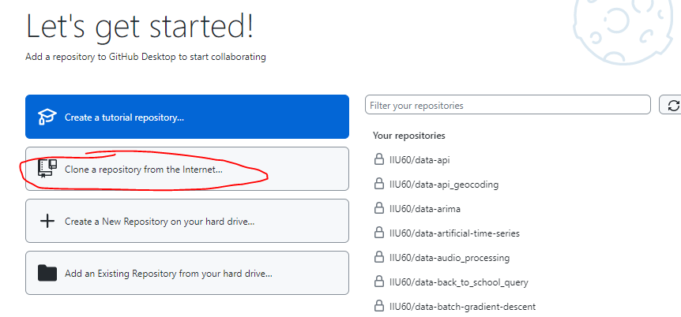</kbd>

3. Clonar al disco local:

<table width="100%">
  <tr>
  <td VALIGN=TOP>
   
   1. Buscar y seleccionar el repositorio (en la barra de búsqueda si se tiene acceso, y si no, pegando el URL del repositorio público en la pestaña de ‘URL’)
     
   2. **Importante** copiar la ruta local de guardado

   3. Hacer clic en el botón de clonar

  </td>
  <td width="50%">
     <kbd></kbd>
  </td>
  </tr>
</table>

4. En la página del repositorio, actualizar el código con el botón ‘Fetch origin’, si ha habido algún cambio al programa.

<kbd>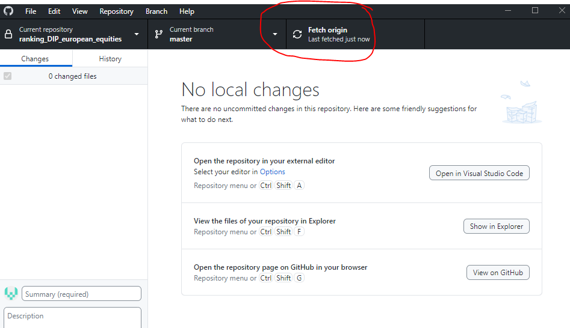</kbd>


## <a name="_toc134614756"></a>Crear Entorno Virtual e Instalar paquetes
1. Abrir una terminal de Anaconda3 (Se llama Anaconda Prompt)
2. 
   <kbd>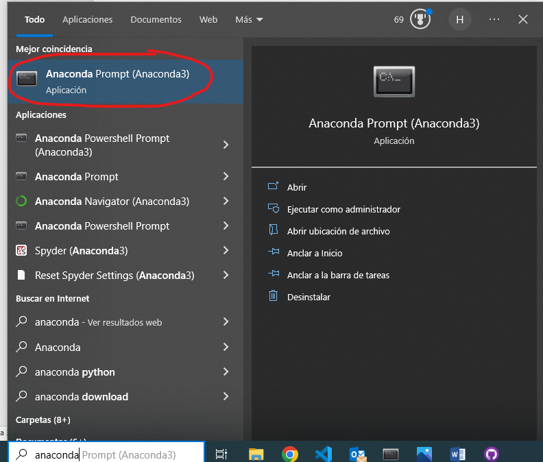</kbd>

3. Crear un entorno virtual con la versión de Python y nombre deseados usando el próximo comando:
   1. `conda create -n equities_ranking python=3.10.9` 
   
      <kbd>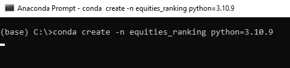</kbd>

   2. al ser preguntado si proceder a instalar paquetes responder que sí con `'y'`

   <kbd>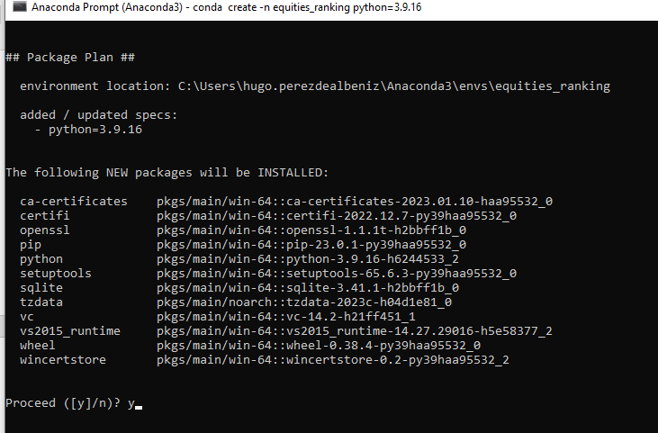</kbd>

3. Activar el Entorno Virtual:
   1. `conda activate equities_ranking`

      <kbd>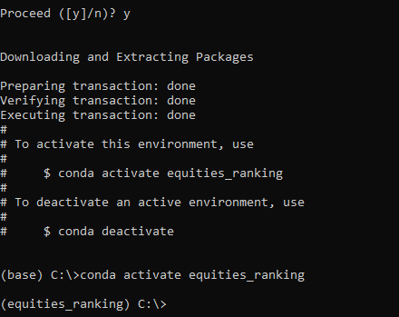</kbd>

4. Navegar al directorio del repositorio:
   1. `cd [ruta a la carpeta ‘ranking_DIP_european_equities’]`

      <kbd>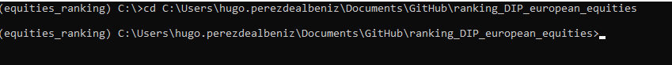</kbd>

*La ubicación predeterminada de los repos de GitHub Desktop está en Documentos/GitHub*

5. Cambiar al directorio con el código de descarga:
   1. `cd eikon_data_retrieval`
6. Instalar requisitos:
   1. `pip install -r data_requirements.txt`

      <kbd>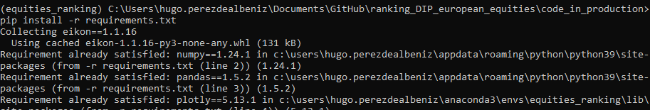</kbd>

Una vez se ha instalado todo correctamente se pueden cerrar todas las aplicaciones usadas hasta ahora.

## <a name="_toc134614757"></a>Configuración de Eikon

La aplicación de Eikon le da al usuario acceso a todas sus funcionalidades, pero para usar la API, la aplicación funciona como vía de conexión (proxy) entre el programa que hace la llamada y los servidores de Reuters. Para esto es necesaria una llave única para la aplicación con la que el programa puede identificarse de forma segura.

### <a name="_toc134614758"></a>Crear un App Key

Para crear una llave de identificación para la maquina en uso hay que seguir los siguientes pasos:

1. Abrir la aplicación de Eikon y entrar con usuario y contraseña
2. Abrir el ‘app key generator’ usando la barra de búsqueda de Eikon

   <kbd>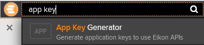</kbd>

3. Elegir un nombre apropiado y descriptivo, seleccionar ‘Eikon Data API’, y presionar en ‘Register New App’

   <kbd>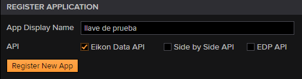</kbd>

4. Aceptar los términos y condiciones
5. Copiar la llave creada y guardar en algún lado temporalmente

   <kbd>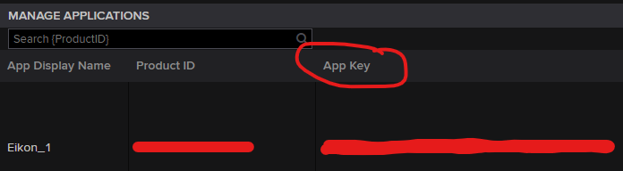</kbd>

Tras esto la aplicación de Eikon está preparada para usar la API.

## <a name="_toc134614759"></a>Configuración de .env

Por motivos de seguridad las llaves de aplicación de Eikon no deben ser compartidas. Para evitar fijarlas en el código y que se compartan sin querer, este programa hace uso de un paquete llamado `python-dotenv` el cual permite crear y añadir variables globales al entorno virtual dentro de un fichero `.env`. Este fichero y sus contenidos deben ser creados en cada máquina y nunca ser compartidos.

Para hacer uso de esta funcionalidad simplemente hay que crear un fichero llamado .env y pegar la llave de Eikon en una variable llamada `EIKON_APP_KEY=Tu llave` (**Ojo. Sin espacios**):

<kbd>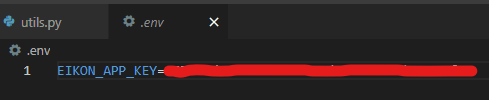</kbd>

El programa buscará este fichero en el directorio `ranking_DIP_european_equities` por lo que debe ser creado/movido aquí.

Ahora ya está todo preparado para descargar datos de Eikon.

# <a name="_toc134614760"></a>Uso de Eikon

La principal aplicación de Eikon, que se necesita para la descarga de datos, se llama Data Item Browser y sirve para acceder a los campos descargables para cada instrumento (acciones, índices, etc) y comprender sus parámetros. Se accede a ella buscando ‘DIB’ en la barra de búsqueda que aparece al abrir Eikon.

<kbd>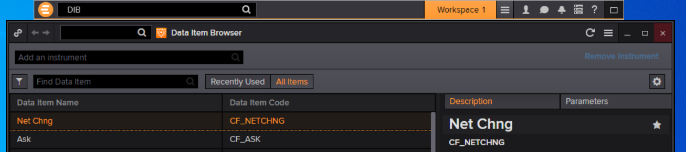</kbd>

Dentro de este buscador se encuentran todos los campos disponibles para cada instrumento y es necesario comprender sus parámetros para hacer la llamada a la API de forma correcta.

Por ejemplo: supongamos que queremos descargar el volumen de mercado para Nestlé, con frecuencia diaria, desde el comienzo de año. Para esto hay que buscar una de las acciones deseadas en la barra de instrumentos (“Add an instrument”) y en “Find Data Item” buscar “volume” lo que mostrará todos los campos relacionados al volumen.

<kbd>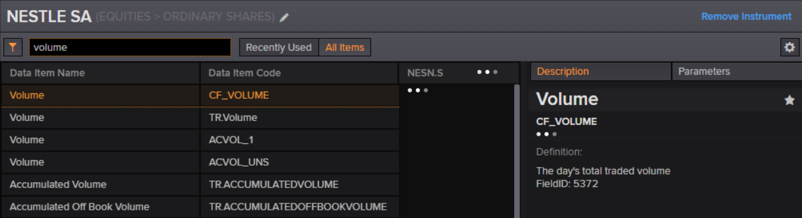</kbd>

Cada campo tiene un apartado con una descripción y sus parámetros predeterminados, además de una pestaña adicional para modificar los parámetros. Generalmente las funciones con series temporales tienen ‘TR.’ de prefijo.

<kbd>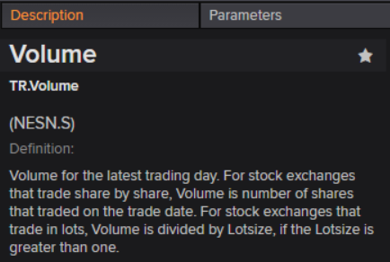  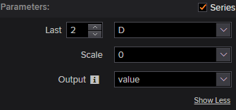</kbd>

El valor de esto es poder investigar los parámetros que requiere cada campo y las distintas opciones con las que se puede llamar su función.  Abriendo el drop-down con la letra ‘D’ se muestra un menú con todos los valores que se pueden pasar al parámetro de frecuencias (‘Frq’). Abriendo el menú de Output se ven todos los sufijos que se pueden añadir a la función para descargar información adicional sobre cada dato; cosas como la fecha, fecha de publicación/fecha de calculo, divisa, etc.

Cada campo tiene su propia parametría por lo que hay que investigarlos siempre antes de hacer las llamadas a la API. Primordialmente los únicos parámetros que hay que especificar son:

- **SDate:** La primera fecha de la llamada. Si la llamada no es para varias fechas, este es el parámetro de fecha.
- **EDate:** la última fecha del rango deseado.
- **Frq:** La frecuencia temporal con la que hacer la llamada (diaria, semanal, mensual, trimestral, etc).
- **Period:** el periodo relativo a la fecha de la llamada. En esencia es como un lag; para la fecha 2023-05-01, period=FY0 devolverá el dato del ‘last financial year’ (2022-12-31), y period=FY-1, la del fin del año anterior (2021-12-31).
- **Curn:** La divisa deseada para el dato (EUR,USD,GBP, etc.)

En la esquina inferior izquierda se va construyendo la formula con la que llamar a la API. En el siguiente apartado se verá como traducir esto a los notebooks de Python.

<kbd>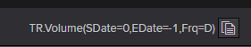</kbd>

# <a name="_toc134614761"></a>Hacer llamadas con Python

Eikon tiene un paquete de Python que, si se han seguido los pasos del primer apartado, estará ya instalado en el entorno virtual. Cualquier notebook/programa con el que descargar datos debe conectarse a la API. Para establecer la conexión a los servidores de Reuters para descargar datos dos cosas deben ocurrir:

1. La aplicación Eikon debe estar abierta y con conexión a internet
1. El programa debe identificarse con la llave de la aplicación

El paso 2 se hace así:
``` python
from dotenv import load_dotenv
import os
import eikon as ek

load_dotenv(r'..\.env') #load environment variables from .env file
ek.set_app_key(os.environ['EIKON_APP_KEY']) #set Eikon API key
```
`ek.set_app_key(‘LLAVE_DE_APPLICACION’)` es la forma de identificar al programa. Lo anterior es para importar la llave desde el fichero .env, lo que es innecesario si no se usa dicha barrera de seguridad.

El paquete de Eikon contiene funciones para descargar noticias y demás, pero para la descarga de indicadores financieros la función más útil es `ek.get_data()`, cuya firma es así:

<kbd>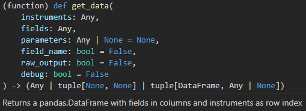</kbd>

La documentación del resto de funciones se halla en el próximo hipervínculo: 
<https://developers.refinitiv.com/en/api-catalog/eikon/eikon-data-api/documentation#eikon-data-ap-is-for-python-reference-guide> 

Para el ejemplo del Volumen diario desde comienzo de año, la llamada se hace así:
```python
df, err = ek.get_data(instruments='NESN.S',
                      fields=['TR.Volume','TR.Volume.date'],
                      parameters={'SDate':'2023-01-01'
                                  'EDate':'2023-05-09',
                                  'Frq':'D'})
```
Lo que devuelve:

<kbd>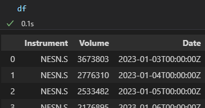</kbd>

`df` es la variable a la que se asigna el pd.DataFrame devuelto por la función y `err` es donde se asigna cualquier error que ocurra en la llamada.

Dentro de `ek.get_data` se especifica el ticker a usar `instruments='NESN.S'` (Nestlé), los campos a descargar como una lista en `fields` (el volumen y la fecha), y los parámetros deseados como diccionario en `parameters`. Los mismos parámetros son pasados a todas las funciones en `fields`. 

Si se desea descargar varios tickers simplemente hay que pasarlos en una lista a `instruments`.

Todas las llamadas siguen este mismo formato.

# <a name="_toc134614762"></a>Uso de los Notebooks de Descarga

En la carpeta `eikon_data_retrieval` hay dos notebooks: `mass_download.ipynb` que sirven para descargar datos de forma masiva (muchos campos y tickers a la vez), y `download_calcs_ranking.ipynb` el cual está diseñado para descargar datos actuales, combinarlos si se desea con las funciones de cálculos disponibles en la plataforma (halladas en `'app/custom_calculations.py'`), rankear los resultados, y extraer los tickers de cada cuantil.

Para descargar datos, ambos se nutren de las funciones escritas en `'eikon_data_retrieval/data_retrieval.py'`

En estos notebooks no hace falta incluir el paso de identificación de Eikon ya que lo hace `data_retrieval.py` de forma automática.

Hay tambien un tercer notebook, llamado `index_constituents_mask.ipynb`, que sirve para crear los filtros de membresia de un indice.

## <a name="_toc134614763"></a>mass_download.ipynb

Después de importar los paquetes necesarios el notebook tiene estas tres celdas:

<kbd>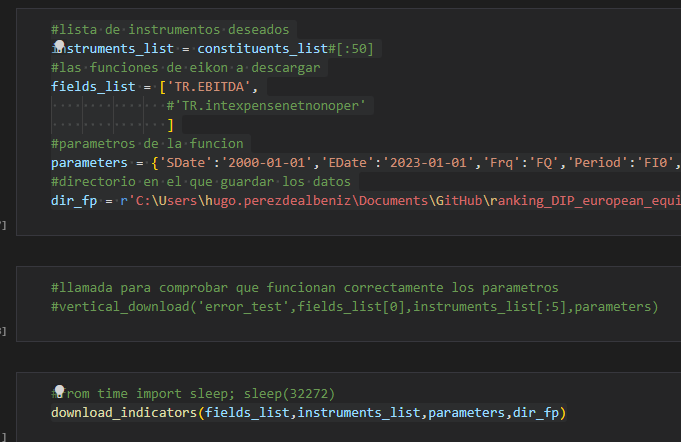</kbd>

En la primera se definen las variables a pasar a `download_indicators` - la función de descarga. Estos son: la lista de tickers a descargar, la lista de campos deseados, el diccionario de parámetros, y la ruta a la carpeta donde se deben guardar los datos.

La segunda celda hace uso de la función `vertical_download` como pequeña prueba, para comprobar que los parámetros funcionan correctamente, antes de comenzar la descarga masiva.

La última celda llama a la función de descarga. Comentada en esta celda hay una línea que hace esperar al programa antes de hacer la llamada a la API lo cual es útil en caso de recibir una penalización de temporal por sobrepasar el límite de descarga por minuto.

Para comenzar a descargar datos simplemente hay que ajustar los campos de la primera celda y correr todo el notebook.

## <a name="_toc134614764"></a>download_calcs_ranking.ipynb

El segundo notebook está diseñado para descargar datos recientes y manipularlos con facilidad (para obtener las listas de tickers que comprar a la hora de rotar cartera). Para ello, además de las funciones de descarga, están importados los scripts con la función de ranking, y el que contiene las funciones de cálculos (`rate_of_change`, `exponential_ma`, `beta`,etc).

El notebook contiene el ejemplo de cómo obtener los rankings de los actuales constituyentes del stoxx600 para un indicador personalizado (una combinación de cálculos a distintos indicadores).

Para descargar los actuales miembros del Stoxx 600 se usa la próxima llamada:

```python
instruments_list = ek.get_data('0#.STOXX','TR.RIC')[0].RIC.tolist()
```
El instrumento `'0#.STOXX'` es una lista de constituyentes creada por Reuters para la cual llamamos al campo de tickers `'TR.RIC'` (Refinitiv Identificación Code). Del DataFrame devuelto, se convierte la columna llamada RIC en una lista asignada a la variable `instruments_list`.

Tras adquirir la lista de instrumentos deseados, se procede a descargar los datos de la misma manera que en el notebook anterior: ajustando los parámetros, el directorio de guardado, y corriendo la función `download_indicators`.

<kbd>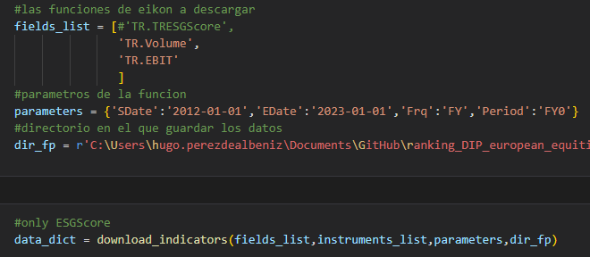</kbd>

Aquí se hace uso del ‘output’ de `download_indicators` que es un diccionario con los DataFrames de los datos descargados.

Si hay una equivocación con los campos (se quieren cambiar tras la primera llamada, o se quieren añadir más), se puede modificar la lista de campos, descargar estos campos y guardarlos en un nuevo diccionario;

<kbd>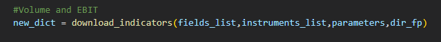</kbd>

para después añadirlos al diccionario original y complementarlo:

<kbd>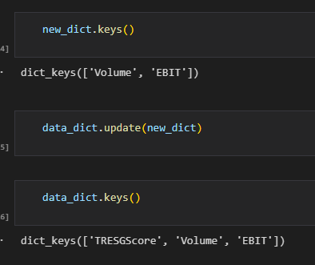</kbd>

Una vez adquiridos los datos se puede comenzar a calcular con ellos.

Extrayendo los datos del diccionario:

```python
esg_df = data_dict['TRESGScore']

volume_df = data_dict['Volume']

ebit_df = data_dict['EBIT']
```

Es importante comprobar la calidad de los datos mirando el número de NaNs que hay en cada DataFrame:

<kbd>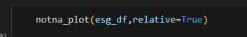</kbd>

Y después diseñar la función de cálculo deseada:
```python
calc1 = calcs.exponential_ma(volume_df.apply(pd.to_numeric),13)

calc2 = calcs.simple_ma(ebit_df.apply(pd.to_numeric),4)

calc3 = calcs.rsi(esg_df,4)

custom_calc_df = calc1*calc2/calc3
```
Aquí, es una media móvil exponencial del Volumen a un año, multiplicada por la media móvil a 3 meses del EBIT, dividido por el RSI a 3 meses del ESGScore.

Con los datos finales calculados, se puede pasar el DataFrame a la función de ranking:
```python
n_quantiles = 10

ranks = af.rank_data(custom_calc_df,n_quantiles,'high').iloc[-1,:]
```
`.iloc[-1,:]` coge la última fila de la tabla – la fecha más reciente (debería ser la actual).

¡Ahora ya son accesibles las listas de tickers de cada cuantil!	

<kbd>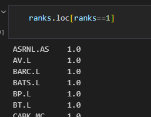</kbd>

## index_constituents_mask.ipynb

Este notebook sirve para generar los ficheros de filtrado de membresía que se pueden usar en la plataforma (mediante "Filepath to index constituency mask"). Como explica la documentación de la plataforma, son ficheros con valores booleanos (Verdadero o Falso) que indican si un activo forma parte del índice en cuestión en cada fecha de los datos. Con ellos se puede eliminar el *suvivorship bias* que conllevaría rankear solamente los datos históricos de los miembros actuales de un índice. Descargando los datos históricos de todos los activos que han formado parte de índice en algún momento, y después filtrando con un fichero de filtro, se obtiene un verdadero backtest de la estrategia deseada.

Después de la primera celda, donde se importan las librerías necesarias y se establece la llave de acceso de Eikon, hay una celda con parámetros:
```python
sdate = '2000-01-01'
edate = '2023-01-01'
index_code = '.SPX'
```
Aquí, como indica el comentario de la celda, hay que cambiar los parámetros a los valores deseados de fecha de inicio, fecha fin, y el código de Eikon del índice deseado. El código del índice se consigue buscando el nombre del índice en la aplicación de Eikon y comprobando que la página del valor tiene una pestaña de "constituents". Por ejemplo, `".SP500"` no es un código valido, a pesar de tener página de índice, pero `".SPX"` sí que lo es.

En la siguiente celda hay que especificar dos rutas. `json_fp` será donde se guarde el filtro en formato .json (un diccionario de fechas con las listas de miembros), y `csv_fp` que es donde se guardará el filtro útil para la plataforma de ranking. Es imprescindible detallar `json_fp` incluso si no se desea guardar este fichero por cómo funciona el código del notebook. Después de obtener el filtro final (el .csv) se puede borrar el .json si se desea.

Después de definir los parámetros, lo único que hay que hacer es ir corriendo el notebook celda a celda, siguiendo los pasos indicados por los comentarios. La mayoría de comentarios son meras explicaciones de lo que hace el código pero hay alguno que pide hacer algo, e.g. `#comprobar que todo tiene buena pinta (mirar número de filas, por ejemplo)` en la celda número 6.

Una vez han corrido todas las celdas correctamente se encontrará el filtro en la ruta `csv_fp` con el cual se puede hacer lo que uno quiera...


# <a name="_toc134614765"></a>Las funciones de Descarga - data_retrieval.py

El fichero `data_retrieval.py` contiene todas las funciones usadas por los notebooks para hacer llamadas a Eikon y limpiar + procesar los datos. Esta sección solo documenta las partes del fichero que pueden ser relevantes para el uso de sus funciones en los notebooks de descarga (en caso de haber algún error usando su configuración actual). En caso de desear comprender todas las funciones con exactitud, el fichero está adecuadamente documentado con comentarios, lo que debería ser suficiente para su entendimiento.

La estructura del código es así:

<kbd>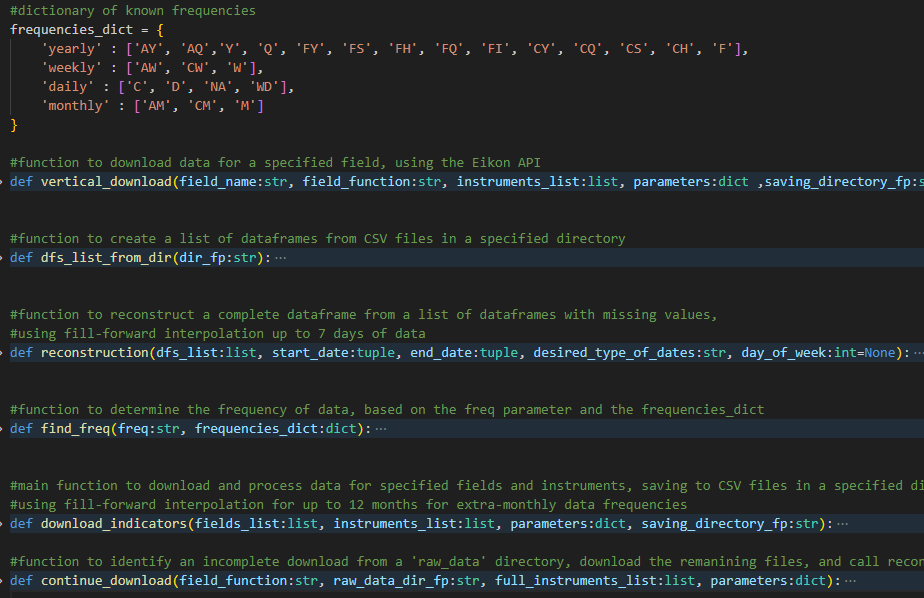</kbd>

## <a name="_toc134614766"></a>vertical_download
Esta función crea las carpetas donde guardar los datos (una con el nombre del indicador y una subcarpeta llamada `'raw_data'` donde guardar los ficheros de cada acción), y hace llamadas al API ‘de manera vertical’ – llamadas individuales para cada acción en vez de iterando sobre las fechas.

Por si sola, se le pueden dar dos usos: 

1. Si ha habido algún error de descarga (y se ha tenido que cortar la llamada), en caso de no querer tener que volver a empezar, se podría modificar la lista de tickers para solo contener los tickers que no se han descargado y juntar los ficheros manualmente.
1. Usarla para una llamada pequeña con intención de comprobar que los parámetros establecidos funcionan correctamente (como se ha mostrado en `mass_download.ipynb`)

La función devuelve una lista con los DataFrames de los datos descargados (guardarlos en `.csv` es una precaución).

## <a name="_toc134614767"></a>reconstruction

Esta es la función de procesamiento de datos. Recibe una lista de DataFrames (normalmente devuelta por `vertical_download`) y devuelve una tabla de datos estandarizada. Además de los DataFrames, requiere dos tuples `(año,mes,dia)` para la fecha de comienzo y fin del periodo, y otro argumento que especifica la frecuencia temporal de los datos.

La función primero junta y limpia los datos, quitando NaNs y filas duplicadas:

<kbd>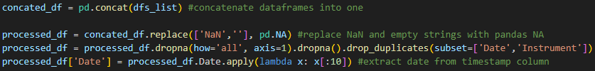</kbd>

Luego hace un pivot de los datos para crear la tabla con las acciones como columnas y fechas en el índice:

<kbd>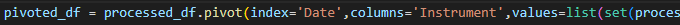</kbd>

Rellena la tabla con todas las fechas (diarias) entre la fecha de comienzo y la fecha fin:

<kbd>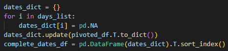</kbd>

Hace un relleno para repetir los datos que faltan hasta un máximo de 7 dias:

<kbd>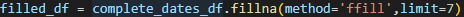</kbd>

Y finalmente selecciona solo las fechas deseadas según el parámetro `‘desired_type_of_dates’`:

<kbd>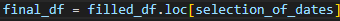</kbd>

Si la frecuencia es menor a mensual (trimestral, bianual, anual, etc.) hace un relleno de 12 meses:

<kbd>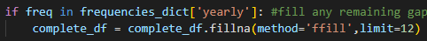</kbd>

## <a name="_toc134614768"></a>dfs_list_from_dir

Esta es una pequeña ‘helper function’ que crea una lista de DataFrames de los ficheros de un directorio. En caso de haber algún error con `reconstruction` se puede usar esta función para obtener el mismo resultado que `vertical_download`, y manipular los datos como sea deseado.

## <a name="_toc134614769"></a>download_indicators

Esta es la función principal del fichero y junta la funcionalidad de todas las otras funciones. Es la que se llama en los notebooks. Recibe los mismos argumentos que `ek.get_data()` además de la ruta donde se deben guardar y descargar los datos.

Lo primero que hace es interpretar los parámetros de la llamada:

<kbd>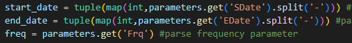</kbd>

Estas líneas especifican el formato del diccionario de parámetros de la llamada: fechas en formato año-mes-día, y debe contener el parámetro de frecuencia.

Después itera sobre la lista de campos a descargar, y para cada uno hace llamadas a las otras funciones para descargar los datos y procesarlos:

<kbd>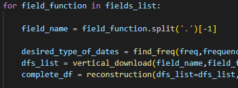</kbd>

Y finalmente guarda el fichero en la carpeta creada por `vertical_download`

<kbd>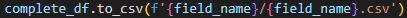</kbd>

## continue_download

Esta es una función diseñada para continuar una descarga que ha fallado por cualquier razón. Toma la ruta a una carpeta de `‘raw_data’` (donde se estaban descargando los ficheros de la descarga fallada), lee los archivos que ya se ha descargado, los compara con la lista total de acciones, y continua la descarga de las que faltan. También llama a `reconstruction` y guarda el fichero generado en el directorio superior a `‘raw_data’`. Su firma es así:

<kbd>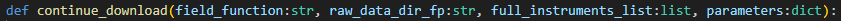</kbd>

La llamada es similar a una mezcla entre `vertical_download` y `download_indicators`. `field_function` es la función de Eikon a descargar (`'TR.EBIT'` por ejemplo), `raw_data_dir_fp` es la ruta absoluta al directorio con los ficheros de la descarga incompleta, `'full_instruments_list'` es la lista de todas las acciones a descargar, y `parameters` es el diccionario de parámetros con el que se estaba haciendo la llamada anterior.

En el notebook `mass_download_vertical` está la próxima muestra de esta llamada:

<kbd>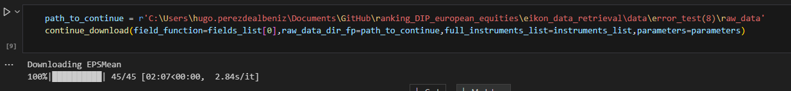</kbd>

# <a name="_toc134614770"></a>Errores de Descarga Conocidos

Esta sección detalla la serie de errores conocidos que pueden ocurrir durante la descarga de datos, y que hacer para arreglarlos.

### <a name="_toc134614771"></a>Failed to decode response to json:

<kbd>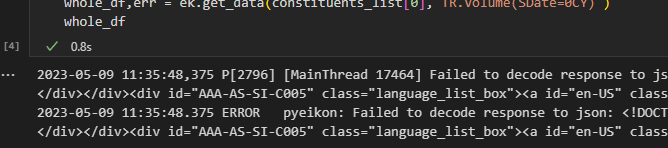</kbd>

Este error ocurre cuando Eikon está abierto, pero no hay una sesión iniciada, ya sea porque otra persona ha entrado con la misma cuenta, o por haber perdido la conexión a internet, por ejemplo. En cualquier caso, la solución no es simple, no se limita a reiniciar la sesión. Hay que reiniciar Eikon del todo (cerrando todas sus instancias en el administrador de tareas, o reiniciando el ordenador).

Si este error salta durante una descarga masiva, es de suma importancia cortar la llamada cuanto antes para evitar sobrepasar el limite de llamadas por minuto/segundo.

