# DOCUMENTACIÓN PLATAFORMA EQUITIES RANKING <!-- omit in toc -->

# <a name="_hlk487785372"></a>Tabla de contenido<!-- omit in toc -->

1. [Instalar en una nueva Maquina](#instalar-en-una-nueva-maquina)
   1. [Clonar el repositorio al disco](#clonar-el-repositorio-al-disco)
   2. [Crear Entorno Virtual e Instalar paquetes](#crear-entorno-virtual-e-instalar-paquetes)
2. [Corriendo el Programa](#corriendo-el-programa)
3. [La Plataforma](#la-plataforma)
   1. [Formulario de Parámetros Inicial](#formulario-de-parámetros-inicial)
      1. [Index constituency filtering:](#index-constituency-filtering)
   2. [Apartado de Gráficos](#apartado-de-gráficos)
      1. [Botones de descarga de ficheros](#botones-de-descarga-de-ficheros)
   3. [Botones de la barra lateral](#botones-de-la-barra-lateral)
      1. [Create Multi-factor Indicator](#create-multi-factor-indicator)
      2. [Create Custom Indicator](#create-custom-indicator)
      3. [Download Indicator](#download-indicator)
4. [Lectura y Uso de la Terminal](#lectura-y-uso-de-la-terminal)
      1. [Reiniciar el Servidor](#reiniciar-el-servidor)
      2. [Situaciones en las que hay que reiniciar](#situaciones-en-las-que-hay-que-reiniciar)

 
# <a name="_toc134438909"></a>Instalar en una nueva Maquina
El programa, para correr, necesita tener todos los ficheros ‘.py’ contenidos en la carpeta ‘app’ del repositorio de GitHub. También necesita la versión de Python 3.10.9 y cumplir con los requisitos de los paquetes supletorios especificados en ‘app\_requirements.txt’. La forma de cumplir con estos requisitos es opcional (uno se puede descargar el código y los paquetes de muchas formas), aunque aquí se detalla como hacerlo con GitHub Desktop y Anaconda, por ser los más simples.

**Pagina descarga de GitHub Desktop:** <https://docs.github.com/en/desktop/installing-and-configuring-github-desktop/installing-and-authenticating-to-github-desktop/installing-github-desktop> 

**Pagina de descarga de Anaconda3**: <https://docs.anaconda.com/anaconda/install/index.html> 

**Repositorio en GitHub:** <https://github.com/IIU60/ranking_DIP_european_equities> 

Tras instalar ambas plataformas:
## <a name="_toc134438910"></a>Clonar el repositorio al disco
1. Abrir GitHub Desktop e iniciar sesión
2. Hacer clic en clonar repositorio de internet

<kbd>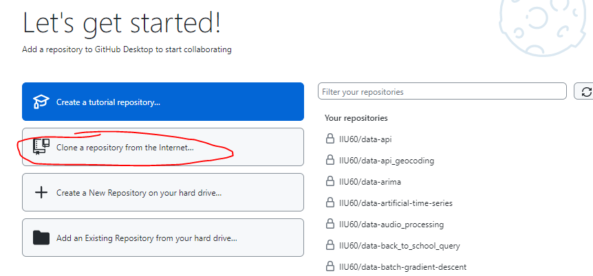</kbd>

3. Clonar al disco local:
<div style="text-align: left; display: grid; grid-template-columns: 1fr 1fr;">
   <div>

   1. Buscar y seleccionar el repositorio (en la barra de búsqueda si se tiene acceso, y si no, pegando el URL del repositorio público en la pestaña de ‘URL’)
   1. **Importante** copiar la ruta local de guardado
   2. Hacer clic en el botón de clonar
   
   </div>
  <div>

   <kbd></kbd>

  </div>
</div>

4. En la pagina del repositorio, actualizar el código con el botón ‘Fetch origin’, si ha habido algún cambio al programa desde la última vez que se instaló el código.

<kbd> </kbd>


## <a name="_toc134438911"></a>Crear Entorno Virtual e Instalar paquetes
1. Abrir una terminal de Anaconda3 (Se llama Anaconda Prompt)
   
   <kbd>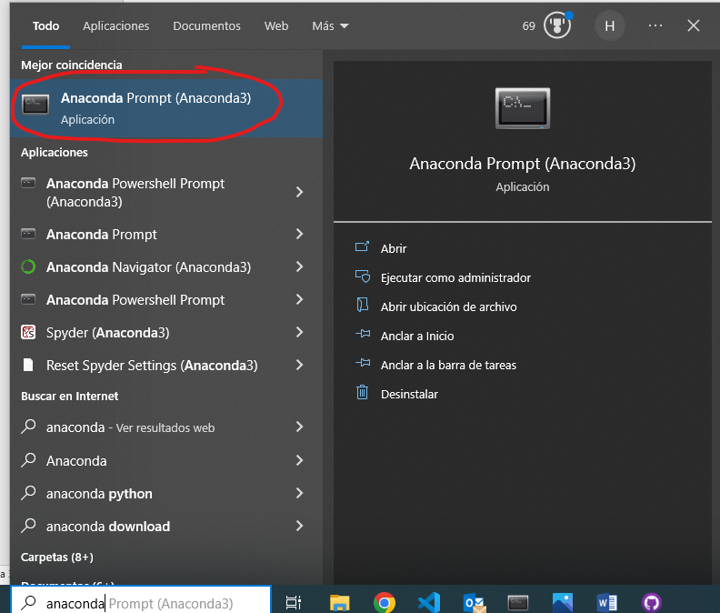 </kbd>

2. Crear un entorno virtual con la versión de Python y nombre deseados usando el próximo comando:
   1. `conda create -n equities_ranking python=3.10.9` 
   
   <kbd> 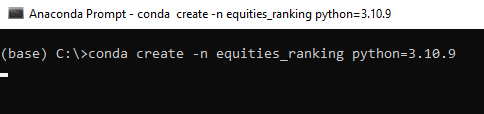</kbd>

   2. al ser preguntado si proceder a instalar paquetes responder que sí con ‘y’

<kbd>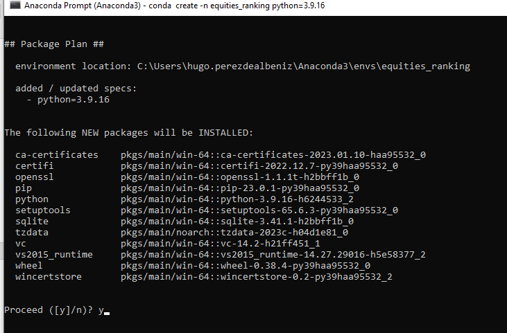</kbd>

3. Activar el Entorno Virtual:
   1. `conda activate equities_ranking`
   
<kbd>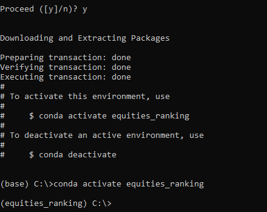</kbd>

1. Navegar al directorio del repositorio:
   1. `cd [ruta a la carpeta ‘ranking_DIP_european_equities’]`

<kbd>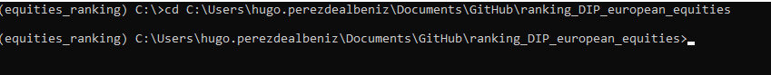</kbd>

*La ubicación predeterminada de los repos de GitHub Desktop está en Documentos/GitHub*

5. Cambiar al directorio con el código:
   1. `cd app`
6. Instalar requisitos:
   1. `pip install -r app_requirements.txt`

<kbd>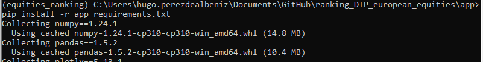</kbd>

Una vez se ha instalado todo correctamente el programa está listo para ser ejecutado y se pueden cerrar todas las aplicaciones usadas hasta ahora.

# <a name="_toc134438912"></a>Corriendo el Programa
Para correr el programa hay que:

1. Abrir una terminal de anaconda
1. Activar el entorno virtual que cumple con los requisitos
1. Navegar a la carpeta con el código
1. Y correr el comando:
   1. `streamlit run app.py`
      
*Los pasos 1-3 coinciden con los pasos 1,3,4 y 5 del apartado anterior*

Una vez hecho esto saldrá lo próximo en la terminal lo cual son las ubicaciones donde se encuentra la plataforma. Se debería abrir automáticamente una pestaña en el navegador predeterminando con el URL local, pero si no, se deberá acceder a él manualmente. 

<kbd>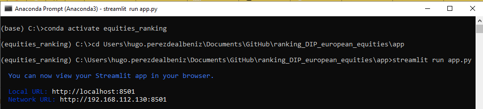</kbd>

# <a name="_toc134438913"></a>La Plataforma
Esta plataforma sirve para identificar correlaciones entre los indicadores financieros de un universo de empresas y los cambios en precio de las mismas. Es decir: sirve para comprender si un indicador es un buen predictor de que los precios de una acción van a subir o bajar. Esto se hace clasificando el universo en cuantiles en cada momento del tiempo, según el orden de valores, y calculando la rentabilidad media de cada agrupación en cada momento. Así se entiende el comportamiento de cada cuantil, y, si se establece una relación progresiva entre las rentabilidades medias de los cuantiles, se puede decir que el indicador en cuestión esta correlacionado con el precio.

Al lanzar el programa, la página tiene el próximo aspecto. Este cambiará, y se iniciará del todo la plataforma, al entregar el formulario de parámetros visible en el apartado izquierdo de la página.

<kbd>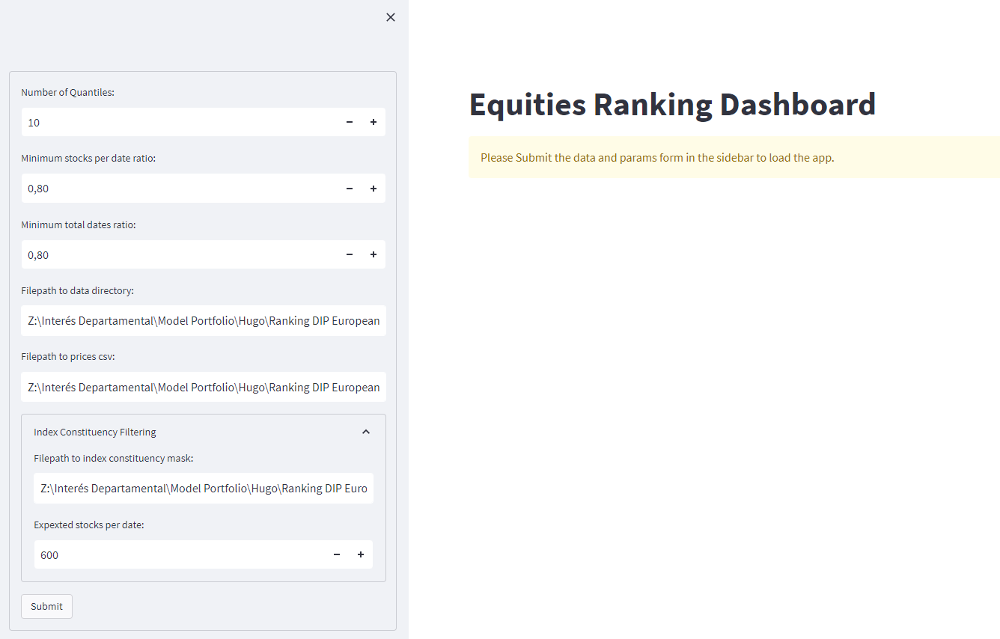</kbd>

## <a name="_toc134438914"></a>Formulario de Parámetros Inicial
**Number of quantiles:**

Este es el número de cuantiles en el que agrupar los datos.

**Minimum stocks per date ratio:**

Este es un parámetro de filtrado que determina la proporción mínima entre el número de datos presentes en cada fila y el valor `Expected Stocks Per Date`. Si el parámetro se establece en 0.8 y más de 120 (20% de 600 – el valor predeterminado de Expected stocks per date) de los valores en una fecha (una fila) son NaN (no existen), esa fecha será rechazada y eliminada de la tabla.

**Minimum total dates ratio:**

Este parámetro, al igual que el anterior, determina la proporción mínima de fechas restantes tras ser filtradas según el mínimum stocks per date ratio. Si el parámetro se define en 0,8 y un 21% de las filas han sido eliminadas (es decir si restan menos de 222 filas en una tabla con las 277 fechas que forman los comienzos de mes desde el año 2000) esa tabla será rechazada y uno no podrá operar con ella en la plataforma.

**Filepath to data directory:**

Esta es la ruta absoluta (desde el directorio base) en la que se encuentran las tablas con datos para procesar. El programa de momento <u>solo acepta ficheros .xlsx, .xlsm, y .csv con comas (“,”) de separador las cuales deben estar formateadas de la próxima manera:</u>

<kbd>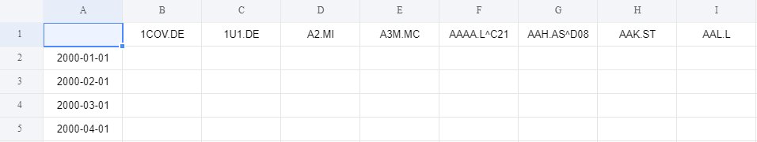</kbd>

<u>(con los nombres de acciones en la primera fila y las fechas en la primera columna). Cualquier otro formato hará imposible la lectura correcta del fichero.</u>

La periodicidad de estos ficheros es opcional (puede ser tanto diaria como mensual) siempre y cuando se proporcione una mascara (fichero filtro) con la que se pueda reducir a fechas mensuales. <u>No se deben introducir al programa datos diarios sin dicho filtro.

Aunque hay redundancias en el programa para prevenir errores de formato (formato de fechas, tipo de separador en csv, nomenclatura de puntos decimales, etc.) es mejor ser lo mas cuidadoso posible con ello para prevenir comportamientos inesperados. </u>

**Filepath to prices csv:**

Esta es la ruta absoluta al fichero de precios. Con este fichero el programa calcula las rentabilidades de cada acción y por tanto de las agrupaciones de acciones. <u>Este fichero debe contener una periodicidad mensual ya que este es el periodo esperado por el programa.</u>

### Index constituency filtering:

*Este es un apartado de parámetros opcionales para filtrar los datos según la membresía de las acciones a un índice.*

**Filepath to index consituency mask:**

Este es la ruta absoluta al fichero de filtrado. Este debe ser una mascara con las misma fechas y acciones que los datos sobre el cual se aplique el filtro (no es necesario que sean exactamente los mismos; el programa se ocupa de reducir ambas tablas a sus elementos comunes antes de aplicar el filtro). El fichero debe contener valores booleanos (True/False), aunque valores binarios (1, 0) también son válidos (1 siendo True y 0 siendo False), indicando la membresía de cada acción en cada momento tal que así: 

<kbd>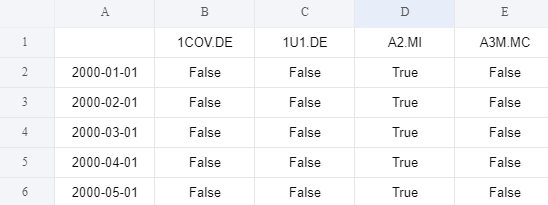</kbd>

<u>Si la aplicación de un filtro no es deseada se puede introducir `None` en vez de una ruta para ignorar este parámetro.</u>

**Expected stocks per date:**

Este parámetro está relacionado con los dos ratios de filtrado anteriormente mencionados. Determina el denominador del ratio “mínimum stocks per date ratio” en caso de que se haya aplicado un filtro de índice. Si el filtro de membresía es del Stoxx 600 este valor debe ser introducido como 600, si es del S&P500 entonces debe ser introducido como 500.

<u>En caso de no desear aplicar un filtro, el valor deberá ser introducido como 0</u> para que los datos se filtren con los valores predeterminados de los anteriores parámetros de filtrado (el total numero de casillas en cada fila). De esta manera, si mínimum stocks per date ratio es 0.8, `Expected stocks per date` es 0 y por ejemplo hay 1600 acciones en el universo en cuestión, si una fecha o fila de datos tiene menos de 1280 valores, esta será rechazada.

<u> Si se introduce como 1, siempre que haya más de una acción en el universo, no se aplicará ningún filtro y los valores de los ratios Mínimum Dates y Stocks per date serán invalidados.</u>

Una vez establecidos todos los parámetros deseados se debe presionar “Submit” para entregar el formulario y correr la aplicación. Al hacer esto aparecerá una ventana indicando los ficheros de datos que han sido rechazados por el filtro. El número mostrado después de cada indicador es la proporción de filas restantes tras ser filtradas, es decir: el numero de filas que superan los criterios mínimos de los parámetros introducidos.

<kbd>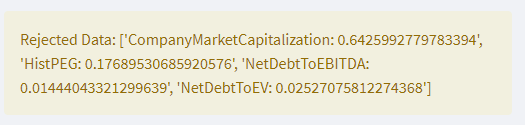</kbd>

En este caso, por ejemplo, solo el 1,4% de las filas de NetDebtToEBITDA, tras aplicarles el filtro de membresía del stoxx600, contienen mas del 80% de 600 valores no-NaN.

Todas las tablas que superan el filtro inicial son añadidas a una lista utilizable por el resto de la plataforma. La forma más fácil de acceder a esta lista es en el ‘drop-down’ del campo “Ratio” en el apartado de gráficos.

## <a name="_toc134438915"></a>Apartado de Gráficos
El resto de la plataforma es bastante intuitiva. El apartado de gráficos tiene una serie de campos que permiten elegir el ratio para graficar, si mostrar el grafico de NaNs o no, y si mostrar los gráficos en escala logarítmica o no, y el rango de fechas a graficar. El campo denominado “Type” determina el tipo de indicador: si es ‘mejor’ o mas rentable que el valor sea mas alto (en cual caso se debe introducir ‘high’) o de lo contrario, si los valores mas rentables son los mas bajos (como puede ser el caso de la deuda) se debe introducir ‘low’. ‘Number of indicators’ determina el numero de columnas que se pueden utilizar para comparar distintos indicadores.

<kbd>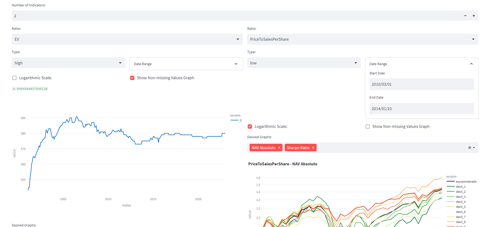</kbd>

### <a name="_toc134438916"></a>Botones de descarga de ficheros

<kbd>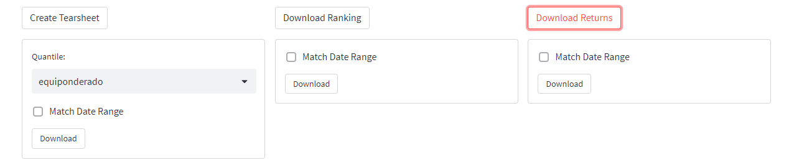</kbd>


Debajo de cada columna hay tres botones que permiten descargar una serie de ficheros. “Download Ranking” y “Download Returns” sirven para descargar el fichero de rankings (el cuantil de cada acción en cada fecha) y el fichero de rentabilidades de los cuantiles, respectivamente.

`Create Tearsheet` sirve para generar y descargar un informe analítico del comportamiento de un cuantil:

<kbd>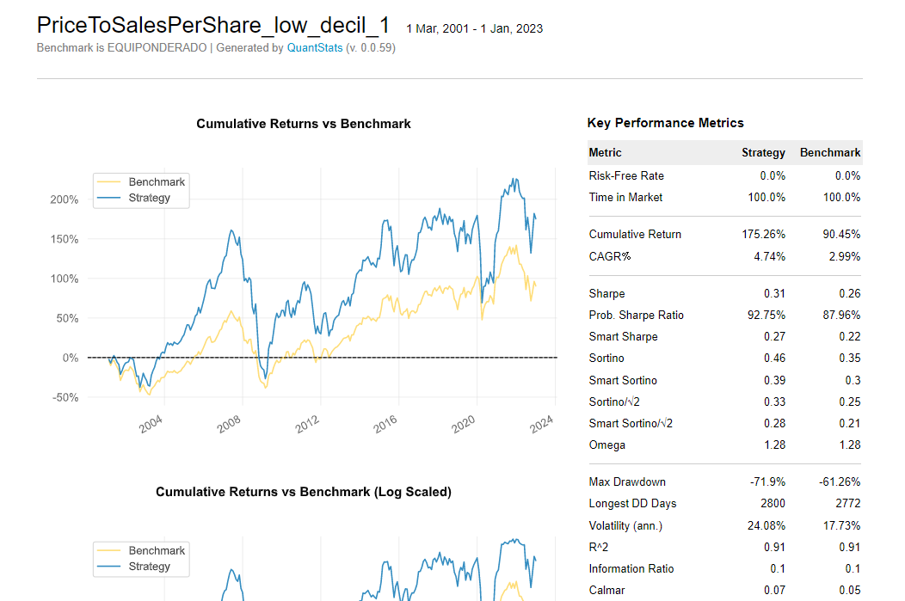</kbd>

Los tres formularios tienen un campo llamado `Match Date Range` que que permite elegir el rango de fechas a descargar con el seleccionador de fechas del apartado anterior.

Al descargar un fichero se creará la carpeta correspondiente en la ruta indicada en **Filepath to data directory,** donde se guardarán las descargas de todos los ficheros.

<kbd>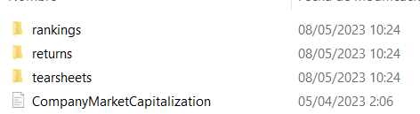</kbd>

## <a name="_toc134438917"></a>Botones de la barra lateral
### <a name="_toc134438918"></a>Create Multi-factor Indicator

Este apartado permite crear indicadores compuestos por una media de pesos variables de los indicadores disponibles en la lista de datos. Esto puede servir para la descorrelacion indicadores o para optimizar sus rentabilidades, por ejemplo.

Haciendo clic en el botón del apartado se abre una tabla como esta:

<kbd>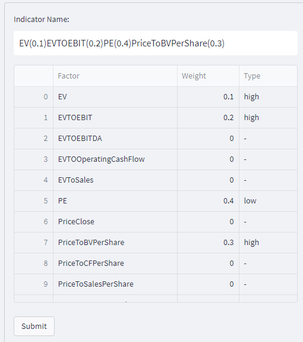</kbd>

Aquí se debe indicar el peso que dar a cada indicador y el tipo de indicador que es. También se debe elegir un nombre para el indicador (es recomendable nombrar a los indicadores de tal forma que se entienda qué parámetros se usaron para crearlos.).

Al hacer clic en ‘Submit’ el programa multiplica los datos por sus pesos correspondientes y crea medias de sus rankings, creando una nueva tabla de valores para graficar. Esta se añade automáticamente al final de la lista de datos.

Ya que lo que hace la función subyacente es calcular las medias de los rankings de cada indicador, y el número más bajo de ranking (el 1) debe corresponder con el decil más rentable, todo indicador compuesto creado a través de esta función será de tipo “low” ya que cuanto más baja sea la media de los rankings más rentable será el indicador.

### <a name="_toc134438919"></a>Create Custom Indicator
Este apartado permite usar funciones predeterminadas sobre los datos y combinarlas de cualquier forma deseada usando la sintaxis de cálculo de Python (+,-,\*,/,\*\*).

<kbd>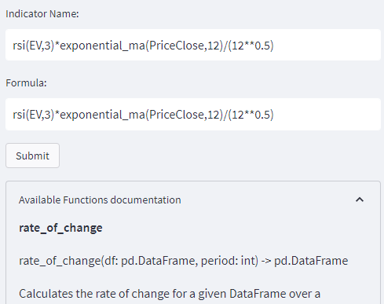</kbd>

Las funciones disponibles y su documentación están escondidos en la pestaña ‘Available Functions documentation’. 

Todas las funciones presentemente disponibles siguen el formato de `nombre_de_funcion(nombre_de_datos, periodo_de_calculo)`

Este ejemplo muestra el RSI del Enterprise Value a 2 meses multiplicado por una media móvil exponencial del precio a 11 meses, todo dividido por la raíz cuadrada de 12. 

**para la mayoría de funciones el periodo usado debe ser N+1**

También aquí es recomendable usar un nombre que detalle la función del indicador.

Al entregar el formulario se calcula la nueva tabla de valores y se hace automáticamente disponible en la lista de datos de la plataforma.
### <a name="_toc134438920"></a>La documentación actual: <!-- omit in toc -->
**rate_of_change**
``` python
'''
rate_of_change(df: DataFrame, period: int) -> DataFrame

Calculate the rate of change of a DataFrame.

This function calculates the percentage change between the current and a prior element in a DataFrame, at a distance of [period] rows.

Parameters:

df (DataFrame): The input DataFrame. 

period (int): The lookback period from which to calculate percent change.

Returns: DataFrame: A DataFrame containing the rate of change.
'''
```
**rsi**

``` python
'''
rsi(df: DataFrame, window: int) -> DataFrame

Calculate the relative strength index (RSI) of a DataFrame.

This function calculates the RSI of a DataFrame using a specified window size.

Parameters: 

df (DataFrame): The input DataFrame. 

window (int): The size of the rolling window. It includes the current row, i.e.: if you want 1 month RSI you should use window=2 (current month and that prior).

Returns: DataFrame: A DataFrame containing the RSI.
'''
```
**simple_ma**
```python
'''
simple_ma(df: DataFrame, rolling_window: int) -> DataFrame

Calculate the simple moving average (SMA) of a DataFrame.

This function calculates the SMA of a DataFrame using a specified rolling window size.

Parameters: 

df (DataFrame): The input DataFrame. 

rolling_window (int): The size of the rolling window. It includes the current row, i.e.: if you want 1 month SMA you should use rolling_window=2 (current month and that prior).

Returns: DataFrame: A DataFrame containing the SMA.
'''
```
**exponential_ma**

```python
'''
exponential_ma(df: DataFrame, rolling_window: int) -> DataFrame

Calculate the exponential moving average (EMA) of a DataFrame.

This function calculates the EMA of a DataFrame using a specified rolling window size.

Parameters: 

df (DataFrame): The input DataFrame. 

rolling_window (int): The size of the rolling window. It includes the current row, i.e.: if you want 1 month EMA you should use rolling_window=2 (current month and that prior).

Returns: DataFrame: A DataFrame containing the EMA.
'''
```
**beta**

```python
'''
beta(df: DataFrame, window_size_months: int) -> DataFrame

Calculate the beta of a DataFrame.

This function calculates the beta of a DataFrame using a specified window size.

Parameters: 

df (DataFrame): The input DataFrame. 

window_size (int): The size of the rolling window. It includes the current row, i.e.: if you want 1 month beta you should use rolling_window=2 (current month and that prior).

Returns: DataFrame: A DataFrame containing the beta.
'''
```

**rolling_volatility**

```python
'''
rolling_volatility(df: DataFrame, window_size: int) -> DataFrame

Calculate the rolling volatility of a DataFrame.

This function calculates the rolling standard deviation of a DataFrame using a specified window size.

Parameters: 

df (DataFrame): The input DataFrame. 

window_size (int): The size of the rolling window. It includes the current row, i.e.: if you want 1 month rolling volatility you should use rolling_window=2 (current month and that prior).

Returns: DataFrame: A DataFrame containing the rolling standard deviation.
'''
```

### <a name="_toc134438921"></a>Download Indicator
Este se explica a si mismo, es un botón para descargar cualquiera de las tablas de datos disponibles en la lista de datos de la plataforma. Su función es permitir el guardado de indicadores multi-factor o personalizados para no tener que crearlos cada vez que se inicie la plataforma. Estos serán añadidos a la carpeta de datos indicada en el formulario de parámetros inicial bajo el nombre indicado.

<kbd>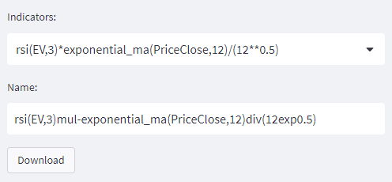</kbd>

Aquí también es recomendable usar un nombre representativo del contenido de los datos solo que el nombre de guardado no puede usar ciertos caracteres reservados para el sistema operativo. Los de Windows se encuentran aquí:

<https://learn.microsoft.com/en-us/windows/win32/fileio/naming-a-file#naming-conventions:~:text=Use%20any%20character,does%20not%20allow> 

La captura de ejemplo remplaza el asterisco de multiplicación con ‘mul-‘, la barra de división con ‘div’, y el doble asterisco de exponente con ‘exp’. La sintaxis usada es opcional, pero debe cumplir con los requisitos de sistema.

***Cuidado:** Si el nombre del fichero a ser descargado coincide con el de otro fichero dentro de la carpeta de datos, el nombre de este será modificado. Aún así, es recomendable guardar una copia de seguridad de los datos en otra carpeta, por si acaso, para evitar comportamientos inesperados.*
# <a name="_toc134438922"></a>Lectura y Uso de la Terminal
En la terminal desde la que se lanza el programa (la que inicialmente contiene la información del servidor local de Streamlit) se va generando un registro de lo que hace la aplicación. Aquí se va escribiendo información como: sobre que indicador se está trabajando (corriendo las funciones de ranking y rentabilidades), si ha habido algún error al hacer esto, o si hay fechas invalidas para ser rankeadas, por ejemplo. También se escriben warnings sobre la falta de un filtro/mask, warnings de pandas y cualquier error que salte mientras se use la plataforma. Los warnings se pueden ignorar con moderación (al menos que se desee el uso de un filtro y sigan saltando los warnings, por ejemplo).

Generalmente es buena idea echarle un vistazo a la terminal de vez en cuando por si ha ocurrido algo inesperado. Si hay un fichero incorrectamente formateado que el programa no es capaz de leer, se evidenciará si las listas de fechas falladas se encuentran con un alto numero de valores. De lo contrario se mostrarán vacías: 

<kbd>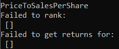</kbd>

También puede ocurrir con cierta frecuencia que la plataforma aparente quedarse inactiva o que esté tardando demasiado algún proceso. Esto no es un comportamiento normal ya que para ficheros de pequeño y mediano tamaño (frecuencias mensuales o mayores) ninguna función tarda mas de 2 segundos en correr. La generación de los Tearsheets es el proceso más tardío y dura unos diez segundos. Si la plataforma se queda congelada mas de esto tiende a ser un error de Anaconda que puede ser arreglado presionando cualquier tecla (mejor presionar la tecla ‘Enter’) un par de veces en la terminal. Si aun así la plataforma no responde o no salta ningún error hay que proceder a reiniciar el servidor.

### <a name="_toc134438923"></a>Reiniciar el Servidor
En la terminal, el comando `Ctrl + c` se usa para interrumpir y forzar que finalice cualquier proceso que este siendo ejecutado. De esta forma se puede tirar el servidor de Streamlit. A veces hay que hacerlo dos veces.

<kbd>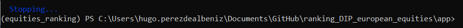</kbd>

Si aun así no se cierra el servidor hay que cerrar la ventana de la terminal.

Habiendo hecho esto simplemente hay que correr `streamlit run app.py` de nuevo para reestablecer la conexión del servidor y continuar usando la plataforma.

Cada vez que se inicia el servidor Streamlit abre una nueva instancia de la plataforma (una pagina nueva) estas pueden correr el paralelo si es preciso, pero no es recomendable; si en segundo plano ocurre un error en una, las demás dejaran de funcionar de manera inesperada. Por esto es recomendable solo tener una ventana abierta con la plataforma a la vez.

### <a name="_toc134438924"></a>Situaciones en las que hay que reiniciar
Aparte de por errores en la plataforma será necesario reiniciar el servidor en los próximos casos:

1. Si hay alguna modificación a los directorios o ficheros a los que accede la plataforma. Si se inserta o renombra un fichero en el directorio de datos, por ejemplo, aunque se vuelva a entregar el formulario de parámetros inicial estos cambios no serán detectados por una cuestión de caching.

